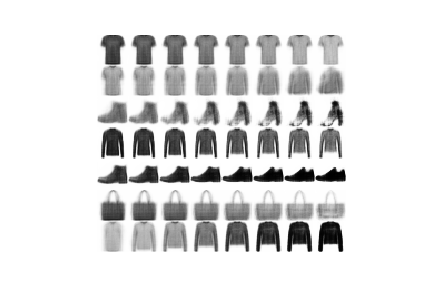
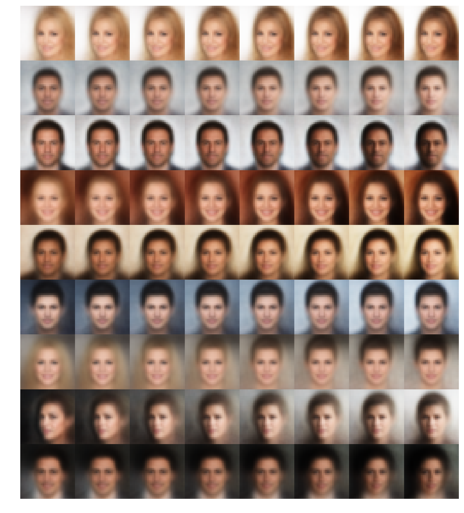
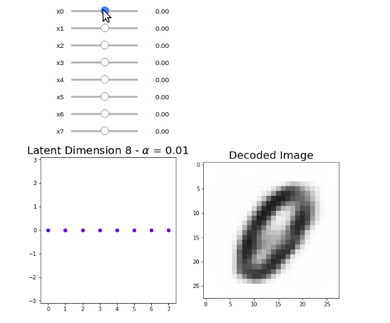
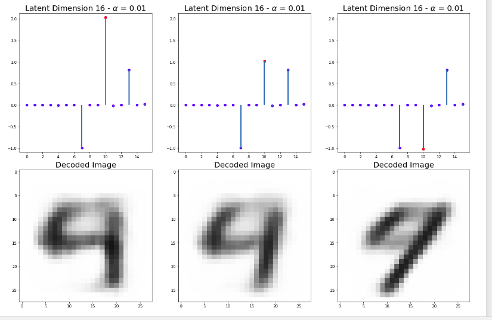
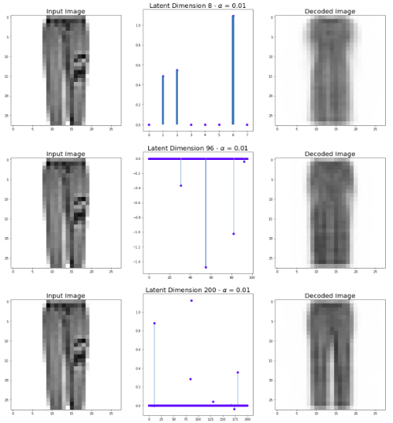
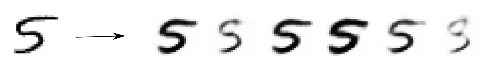
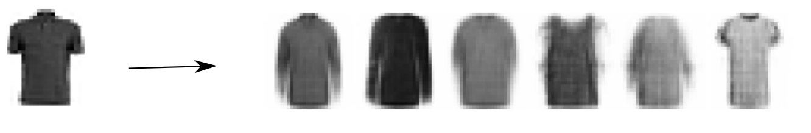

# Variational-Sparse-Coding

We aim to replicate the experiments described in the paper ["Variational Sparse Coding"](https://openreview.net/forum?id=SkeJ6iR9Km) from the ICLR 2019 submissions, as part of our participation in the  [ICLR Reproducibility Challenge 2019](https://reproducibility-challenge.github.io/iclr_2019/).


## Table of content
- [Description](#description)
- [Authors](#authors)
- [Results](#results)
- [Usage](#usage)
- [References](#references)
- [Acknowledgements](#acknowledgements)
- [License](#license)

## Description 

We replicate the results of the recent paper *Variational Sparse Coding* and extend the results to new experiments.

## Authors

 - [Alfredo de la Fuente](https://alfo5123.github.io/)
 - [Robert Aduviri](https://github.com/Robert-Alonso)

## Results

**Latent Space Traversal Generation (200 dimensions -   = 0.01)**

MNIST               |  Fashion-MNIST               | 
:-------------------------:|:-------------------------:
  |   


<center>
 
| CelebA | 
| :-------------------------: |
|  |

 </center>


**Playing with low-dimensional latent space variables**

<div align="center">
 
</div>

**Reconstruction results by modifying encoding in 200-dimensional latent space**


<div align="center">
 
</div>

<div align="center">
 
</div>

**Varying latent space dimensionality**

MNIST               |  Fashion-MNIST               | 
:-------------------------:|:-------------------------:
  |   


**Conditional Sampling**
<div align="center">
 
</div>

<div align="center">
 
</div>

## Usage

### Set up

>Requires Python 3.6 or higher.

The following lines will clone the repository and install all the required dependencies.

```
$ https://github.com/Alfo5123/Variational-Sparse-Coding.git
$ cd Variational-Sparse-Coding
$ pip install -r requirements.txt
```

### Datasets

In order to download datasets used in the paper experiments we use
```
$ python setup.py [datasets...]
```

with options `mnist`, `fashion` and `celeba`. For example, if case you want to replicate *all* the experiments in the paper, we must run the following line:

```
$ python setup.py mnist fashion celeba
```

It will download and store the datasets locally in the **data** folder. 

### Pretrained Models

Aiming to simplify the reproducibility research process, we store the checkpoints of the trained models in the following [link](https://drive.google.com/open?id=1rW02-rpQxAk9yLco8OTMFzFI28o-qOQI). In order to run the scripts & notebooks using pretrained models, you must download the checkpoints and put them in **models** within the **src** folder.

### Train Models 

```
$ cd src
$ python [model] [args] 
```

For example

```
$ python train-vae.py --dataset mnist --epochs 500 --report-interval 50 --lr 0.01 
```

```
$ python train-vsc.py --dataset celeba --epochs 20 --report-interval 4 --lr 0.001 --alpha 0.2 --hidden-size 2000,2000 --latent-size 800
```

To visualize training results in TensorBoard, we can use the following command from a new terminal within **src** folder. 

```
$ tensorboard --logdir='./logs' --port=6006
```


## References

Papers:
- **[Variational Sparse Coding](https://openreview.net/pdf?id=SkeJ6iR9Km)**
- [Auto-Encoding Variational Bayes](https://arxiv.org/pdf/1312.6114.pdf)
- [Large-Scale Feature Learning With Spike-and-Slab Sparse Coding](https://arxiv.org/pdf/1206.6407.pdf)
- [Stick-Breaking Variational Autoencoders](https://arxiv.org/pdf/1605.06197.pdf)
- [beta-VAE: Learning Basic Visual Concepts with a Constrained Variational Framework](https://openreview.net/pdf?id=Sy2fzU9gl)
- [Disentangling by Factorising](https://arxiv.org/pdf/1802.05983.pdf)
- [Neural Discrete Representation Learning](https://papers.nips.cc/paper/7210-neural-discrete-representation-learning.pdf)
- [Tutorial on Variational Autoencoders](https://arxiv.org/pdf/1606.05908.pdf)

## Acknowledgements 

Special thanks to [Emilien Dupont](https://github.com/EmilienDupont) for clarifying distinct aspects on variational autoencoders' implementation, and [Lukas Mosser](https://github.com/LukasMosser) for his suggestions on training generative models.

## License
[MIT License](https://github.com/Alfo5123/Variational-Sparse-Coding/blob/master/LICENSE)

